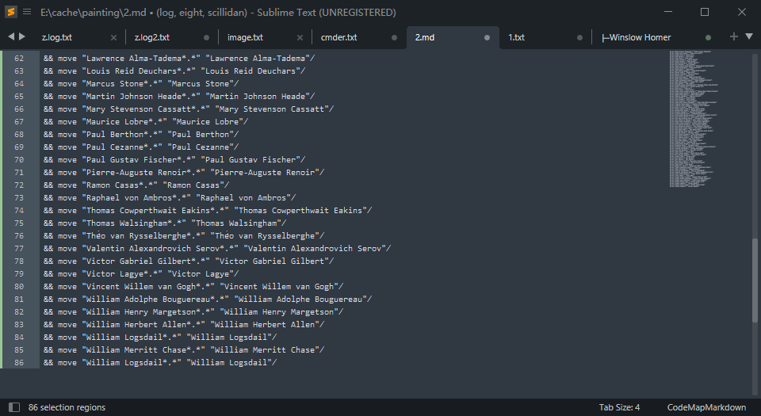
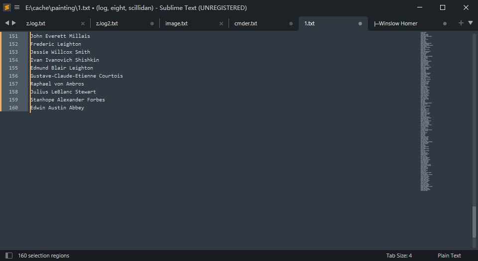
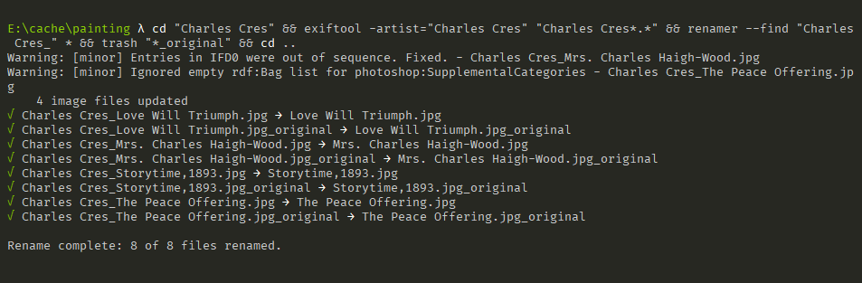
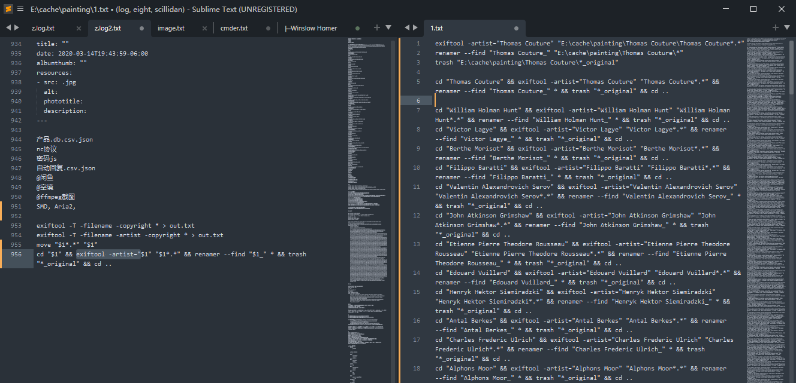
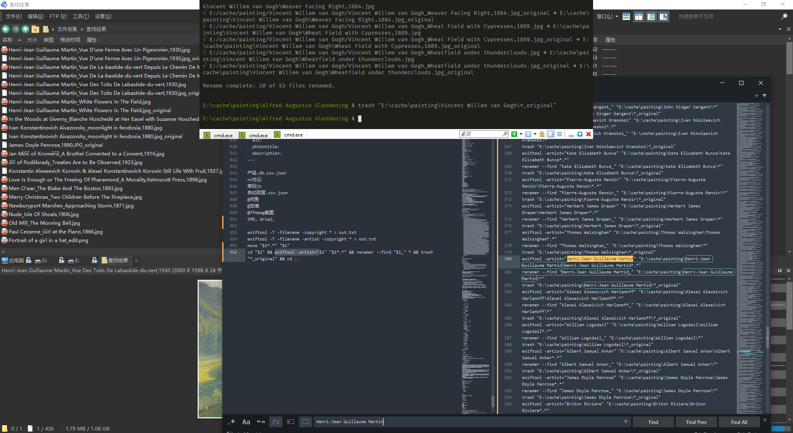
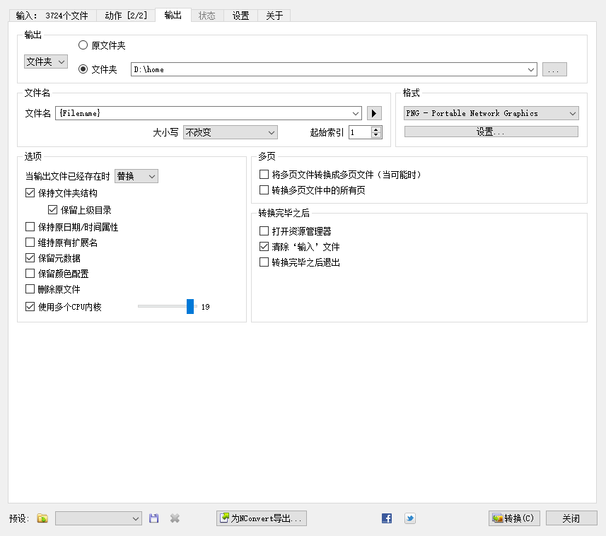

- av1an
	- ```sh
	  scoop install vapoursynth vmaf
	  py .../vsrepo.py update
	  py .../vsrepo.py install lsmas ffms2
	  scoop install nasm emscripten
	  emsdk install latest
	  emsdk activate latest
	  ```
	  
	  ```sh
	  git clone https://github.com/m-ab-s/aom
	  mkdir aom-windows-build
	  cmake -S ./aom -B ./aom-windows-build -G "Visual Studio 17 2022"
	  cd ./aom-windows-build
	  cmake --build .
	  ```
- ChatGLM2-6B
	- ```sh
	  venv\Scripts\streamlit.exe run web_demo2.py
	  ```
- Jupyter
	- ```sh
	  pip install --user ipykernel
	  ipython kernel install
	  jupyter-lab
	  ```
- Keyprinha
	- tldr
		- ```sh
		  scoop install tldr
		  tldr -c
		  ```
		  
		  Create symbolic link from `C:\Users\yourname\AppData\Roaming\tldr\pages.en` to `C:\Users\yourname\.cache\tldr\pages.en`
	- PuzzTools
		- ```sh
		  7z a PuzzTools.zip ./* -x!.git/ && mv PuzzTools.zip ...C:/Users/yourname/scoop/persist/keypirinha/portable/Profile/InstalledPackages/PuzzTools.keypirinha-package
		  ```
- komga
	- ```sh
	  for /d %%X in (*) do arenc.exe -e "v01.aren" -t folders -p . -m rename
	  for /d %%X in (*) do arenc.exe -e "001.aren" -t files -p %%X -m rename
	  for /d %%X in (*) do cp %%X/001.jpg %%X/cover.jpg
	  for /d %%X in (*) do py39 to_cbz.py %%X
	  python39 komga_cover_extractor.py -c "True" -cq "70" -p .
	  ```
- Logisim-evolution
	- ```sh
	  C:\Users\scillidan\scoop\apps\openjdk\current\bin\javaw.exe -jar C:\Users\scillidan\scoop\apps\logisim-evolution\current\logisim-evolution.jar
	  ```
- logseq-whisper-subtitles-server
	- ```sh
	  venv\Scripts\python.exe -m flask -A logseq_whisper_subtitles_server\app.py run --host=127.0.0.1 --port=5014
	  ```
- pipenv
	- ```sh
	  pip install --user pipenv
	  ```
- raphael-impress
	- {:width 300,:height 120}
	  
	  {:width 300,:height 120}
	  
	  {:width 300,:height 120}
	  
	  {:width 300,:height 120}
	  
	  {:width 300,:height 120}
	  
	  {:width 300,:height 120}
	  
	  {:width 300,:height 120}
	  
	  {:width 300,:height 120}
- syncabook
	- ```sh
	  git clone [GitHub - r4victor/syncabook: 📖🎧 A tool for creating ebooks with synchronized text and audio (EPUB3 with Media Overlays)](https://github.com/r4victor/syncabook)
	  cd syncabook
	  pvthon37 -m venv venv
	  venv\Scripts\activate.bat
	  git clone [GitHub - r4victor/afaligner: 📈 A forced aligner intended for synchronization of narrated text](https://github.com/r4victor/afaligner) _afaligner
	  cd _afaligner
	  pip install -e .
	  edit setup.py
	  cd ..
	  ```
	  
	  See [Check out this ShareGPT conversation](https://sharegpt.com/c/97thh2m)
	  
	  ```sh
	  pip install pytest epubcheck
	  python -m pytest -s tests/
	  ```
	  
	  ```sh
	  syncabook download_files theurl thebook
	  ```
	  
	  ```sh
	  syncabook split_text --mode opening --p theindex thebook\text.txt thebook\plaintext
	  syncabook split_text --mode delimeter --p theindex thebook\text.txt thebook\plaintext
	  syncabook split_text --mode equal --n 2 thebook\text.txt thebook\plaintext
	  ```
	  
	  ```sh
	  syncabook to_xhtml thebook/plaintext/ thebook/sync_text/
	  syncabook sync thebook/
	  ```
	  
	  ```sh
	  syncabook create thebook
	  ```
	  
	  ```sh
	  cd _synclibrivox\books\_little_prince\ // Cache
	  syncabook.exe split_text --m opening --p 第一章 text.txt plaintext
	  iconv -f gbk -t utf-8 plaintext\1.txt > plaintext\_1.txt && trash plaintext\1.txt && move plaintext\_1.txt plaintext\1.txt
	  syncabook.exe to_xhtml plaintext sync_text\
	  iconv -f gbk -t utf-8 sync_text\1.xhtml > sync_text\_1.xhtml && trash sync_text\1.xhtml && move sync_text\_1.xhtml  sync_text\1.xhtml
	  syncabook sync _synclibrivox\books\_little_prince
	  syncabook create thebook
	  ```
- faster-whisper-webui
	- Full → Language(Chinese) → Upload Files → VAD(silero-vad-skip-gaps) → Initial Prompt(对于普通话句子，以中文简体输出) → Diarization - Speakers(), Min Speakers(1), Max Speakers() → Submit
-